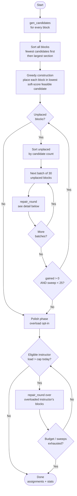
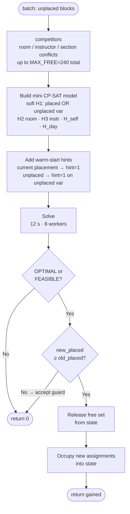

# Kairos — UCTP Optimization Model

A formal description of the University Course Timetabling (UCTP) model implemented in
`src/timetabling/`. This is the ground-truth specification: it mirrors `model_cpsat.py`
(the declarative CP-SAT model), `repair.py` (the production solver), `config.py`
(the tunable defaults), and `settings.py` (the per-school overrides exposed in the UI's
School Settings step). When the code and this document disagree, the code wins — update
this file.

The solver decides, for each undergraduate course **block**, a **(room, day, start-hour)**.
Section / instructor / size / T-P-L are fixed inputs; the only decisions are **time** and
**room**.

---

## 0. Scheduling constraints at a glance

A plain-language checklist of every rule the schedule obeys. Sections 3–6 give the formal
CP-SAT encoding; this list is the human-readable summary. Each item notes whether it is a
**hard** rule (can never be violated) or a **soft** preference (penalized, never blocking),
and where it lives (pruning, model relation, or objective).

### What is fixed vs. decided

- **Fixed inputs:** each section's instructor(s), Section Capacity (quota), and T/P/L hours.
- **Decided:** for every block of every section, a `(room, day, start-hour)`.
- A section is split into **blocks**: theory hours `T+P` into sessions of at most 2 h (e.g.
  `T=3 → 2+1`), plus one lab block of `L` hours (split at 4 h). Each block is placed once.

### Hard constraints — enforced by candidate pruning (per block)

A placement that breaks one of these is never even generated, so it cannot occur.

- **Capacity** — a block goes only in a room whose capacity ≥ the section's size. The virtual
  `Online` room is exempt (unlimited).
- **Lab-room pinning** — a lab block is pinned to the section's designated real lab room; it
  can go nowhere else. Labs with no designated lab room use regular rooms.
- **Daytime window** — an undergraduate block must end by **18:00** (start no earlier than
  09:00). Graduate blocks (if enabled) end by **21:00** and start no earlier than a
  **configurable** hour (default **18:00**; School Settings can lower it to allow daytime
  graduate classes).
- **Blackout slots** — closed `(day, hour)` slots are **school-specific and configurable**
  (none by default; add them in the School Settings step). Each slot has a scope: *everyone*
  (closed for all sections) or *full-time only* (closed only when a section has a full-time
  staff instructor — e.g. a faculty seminar). Common examples: a Friday 13:00–14:00
  congregational-prayer hour (everyone), or a Thursday 14:00–16:00 staff seminar
  (full-time only).
- **Instructor availability** — a block is never placed in a half-day an instructor marked
  unavailable; every co-instructor's unavailability applies (a per-instructor blackout, set
  in the School Settings step).
- **Fixed session** — if a section declares a fixed slot, its **first block** is pinned to
  exactly that `(day, start-hour)` (its remaining blocks schedule freely).
- **Room type** — rooms carry a categorical type (`normal / lab / pc / studio`). When a section
  declares a `Room Type` demand, its blocks go only in rooms of that **exact** category
  (`pc`→`pc`, `studio`→`studio`, `lab`→`lab`); a generic lab demand falls back to any lab-family
  room (`is_lab`). With no demand, any fitting room.

### Hard constraints — enforced as model relations (across blocks)

- **Exactly-one placement** — every block is scheduled exactly once. (In the `--repair`
  solver this is relaxed so a block may stay unplaced, yielding a partial schedule.)
- **Room no-overlap** — at most one block occupies a physical room in any hour. (The `Online`
  virtual room is exempt.)
- **Instructor no-overlap** — no instructor is double-booked in any hour; every co-instructor
  of a team-taught section counts.
- **Section self no-overlap** — two blocks of the same section never overlap in time.
- **Theory different-day** — a section's theory sessions each fall on a **different day**
  (a `2+1` split occupies two days). Lab blocks are exempt.

### Soft preferences — penalized in the objective (never block a schedule)

Listed heaviest weight first; weights live in `config.py`.

- **Avoid evenings** (`w_evening=10`) — penalize each teaching-hour at or after 17:00.
- **Cohort course-conflict** (`w_cohort_conflict=50`) — penalize each extra distinct course a
  `(dept, year)` cohort runs in the same slot. A *soft proxy* — a hard version was infeasible.
- **Compress instructor weeks** (`w_instr_days=3` full-time, `w_parttime_days=5` part-time) —
  penalize each distinct day an instructor must come to campus; part-timers weigh more.
- **Cohort daily compactness** (`w_cohort_gap=3`) — penalize idle gaps within a year-2/3/4
  cohort's day.
- **Fewer rooms** (`w_room_count=2`) — penalize each physical room used at all (consolidate).
- **Level ordering** (`w_order=1`) — prefer low-level courses early, high-level courses late;
  level-1 and graduate excluded.
- **Engineering labs late-week** (`w_englab=1`) — prefer Engineering lab blocks on Thu/Fri.
- **Instructor daily overload** (`w_instr_daily_overload=0`, opt-in) — penalize teaching-hours
  beyond 4 h/day per instructor; only for instructors with ≤16 h/week total. Off by default
  because a hard daily cap is infeasible (service-course instructors carry >20 h/week).
- **Instructor weekly-days overload** (`w_instr_weekly_overload=0`, opt-in) — penalize each
  distinct teaching day beyond a weekly cap (`max_instr_weekly_days=5`) per instructor (no
  high-load exemption — it applies to every instructor). Off by default; the School-Settings
  "instructor weekly-days cap" turns it on. Distinct from the day-compression term, which
  minimizes days outright rather than penalizing only those beyond a cap.
- **Non-adjacent split** (`w_nonadjacent=0`, disabled) — superseded by the hard theory
  different-day rule.

### What "0 hard violations" means

`validate.py` independently re-checks: placement, capacity, lab-room, daytime window,
blackouts, room/instructor/self no-overlap, theory different-day, and the School-Settings
hard rules — **room-type** (lab requirement), **fixed** (pinned first block), and
**instructor-unavailable**. Cohort conflict and instructor overload are **soft metrics**,
never hard violations.

### Per-school configuration (School Settings)

Every value above is a default tuned to our own institution; the **School Settings** UI step
lets another school override them without touching code. A session **Settings** dict plus an
instructor-availability map are turned into a `Config` by `settings.build_config` at solve
time: the day window, blackout slots, Saturday / graduate toggles, block-split policy, the
instructor daily-hours cap, and the soft-preference weights (as off / normal / strong presets)
are all configurable; optional course-list columns (`Year`, `Part-time`, `Room Type`, `Fixed`)
override the string-derived cohort / part-time / lab / pin. Unconfigured settings reproduce the
defaults documented here exactly, so this section stays the ground truth for the out-of-the-box
behavior. A downloadable "school profile" JSON persists a school's settings + availability.
**§9 is the exhaustive control-by-control list of what the UI exposes.**

---

## 1. Sets and indices

| Symbol | Meaning | Source |
|---|---|---|
| $S$ | sections (one cohort offering of a course) | `derive.build_sections` |
| $B$ | blocks; each section contributes one or more | `derive.blocks_from_tpl` |
| $B_s \subseteq B$ | blocks of section $s$ | |
| $R$ | rooms, physical $R_{\text{phys}}$ plus virtual ($\texttt{Online}$) | `classrooms.csv`, `route.mark_virtual` |
| $I$ | instructors (a section may have several — team teaching) | `lecturers.csv` |
| $I_b \subseteq I$ | instructors of the section owning block $b$ | |
| $D$ | days $\{\mathrm{Mo,Tu,We,Th,Fr}\}$ (Sa optional) | `Config.days()` |
| $H$ | hour-slots, $9 \le h < 21$ | `horizon_start`, `horizon_end` |
| $K$ | cohorts $k=(\text{dept code},\ \text{year level})$ | `Section.cohort_key` |
| $\mathcal{C}(b)$ | legal candidate placements $(r,d,h)$ of block $b$ | `gen_candidates` |

**Blocks** are derived from a section's T/P/L hours:

- Theory hours $T+P$ split into sessions of at most `max_theory_session` $=2$ h (e.g.
  $T{=}3 \to 2+1$), each forced onto a different day.
- One lab block of $L$ hours, split at `max_block_len` $=4$ h, pinned to the section's
  real lab room.
- Block ids: single `#T` / `#L`; split `#T1..#Tk` / `#L1..#Lk`. Kind detected by
  `"#L" in block_id`; `section_id = block_id.split("#")[0]`.

---

## 2. Parameters

| Symbol | Meaning | Default | Knob |
|---|---|---|---|
| $\mathrm{cap}_r$ | capacity of room $r$ | — | `classrooms.csv` |
| $n_s$ | students in section $s$ | — | enrollment |
| $\ell_b$ | length of block $b$ (hours) | — | T/P/L |
| $\mathrm{lvl}_s$ | course level of section $s$ ($1\dots4$) | — | course code |
| $C$ | daily teaching-hours cap | $4$ | `max_instr_daily_hours` |
| $C_w$ | weekly distinct-day cap | $5$ | `max_instr_weekly_days` |
| $W$ | weekly-load exemption threshold | $16$ | `overload_exempt_weekly` |
| — | undergrad end-of-day | 18:00 | `undergrad_end` |
| — | graduate window | 18:00–21:00 | `grad_start`, `grad_end` |
| — | evening threshold | 17:00 | `evening_from_hour` |
| — | blackout slots (universal / full-time-only) | none | `blackout` (School Settings) |
| — | AM/PM boundary (legacy half-day availability) | 13:00 (fixed) | `midday_split_hour` |
| — | per-instructor unavailable slots | — | `instr_unavailable` (School Settings) |

---

## 3. Decision variables

| Symbol | Domain | Meaning |
|---|---|---|
| $x_{b,r,d,h}$ | $\{0,1\}$ | $=1$ iff block $b$ occupies room $r$, day $d$, starting at hour $h$ |

- A variable is created **only for legal candidates** $(r,d,h)\in\mathcal{C}(b)$ — see the
  pruning note below. The full index product is never materialized.
- Auxiliary variables used by the objective and the different-day rule are derived from
  $x$: day-activity $z_{s,b,d}=\max_{r,h}x_{b,r,d,h}$, room-used, instructor-day indicators,
  cohort slot-busy / first / last, and overload integers $o_{i,d}$.

**Candidate pruning (key design decision).** Per-block hard rules are enforced by *not
creating* the variable rather than by adding a model row. `gen_candidates` emits
$(r,d,h)$ only when it already satisfies:

- room capacity $\mathrm{cap}_r \ge n_s$ (the virtual `Online` room is exempt — unlimited);
- lab-room pinning — a lab block only in the section's designated lab room;
- undergrad window $h + \ell_b \le 18$;
- configured blackout slots (`Config.blackout`; none by default — each is universal or
  full-time-only, resolved per section via `cfg.closed_hours`);
- per-instructor availability (`Config.instr_unavailable`) — a candidate is dropped if any of
  the section's instructors is marked unavailable over its span;
- fixed-slot pin — a section's first block is restricted to its declared `(day, start)`;
- room-type — when a section declares a `Room Type`, only rooms of that category are emitted
  (`pc`/`studio`/`lab` exactly, or any lab-family room for a generic lab demand).

Best-fit additionally caps each block to the `max_rooms_per_block` smallest fitting rooms.

---

## 4. Hard constraints

Listed one per block. Each is a model relation; the per-block rules folded into pruning
(capacity, lab-room, window, blackout) are **not** repeated here.

### H1 — placement (exactly one)

$$
\sum_{(r,d,h)\,\in\,\mathcal{C}(b)} x_{b,r,d,h} \;=\; 1 \qquad \forall\, b \in B
$$

- Every block is scheduled exactly once, into one of its legal candidates.
- Because the sum is over $\mathcal{C}(b)$ only, an infeasible placement is unreachable.
- In `repair` this is **soft** (a block may stay unplaced) so a partial schedule always
  exists; in `model_cpsat` it is hard.

### H2 — room no-overlap

$$
\sum_{\substack{b,\,h' \,:\, h\,\in\,[h',\,h'+\ell_b)}} x_{b,r,d,h'} \;\le\; 1
\qquad \forall\, r \in R_{\text{phys}},\; d,\; h
$$

- At most one block occupies a physical room during any hour-slot.
- The inner condition $h\in[h',h'+\ell_b)$ expands a block over every hour it spans.
- The virtual `Online` room is excluded from $R_{\text{phys}}$ — it has unlimited capacity
  and is exempt from this constraint.

### H3 — instructor no-overlap

$$
\sum_{\substack{b \,:\, i \in I_b}}\ \sum_{\substack{h' \,:\, h\,\in\,[h',\,h'+\ell_b)}} x_{b,\cdot,d,h'} \;\le\; 1
\qquad \forall\, i \in I,\; d,\; h
$$

- No instructor is double-booked in any hour-slot.
- A team-taught section enters the sum of **every** co-instructor.

### H_self — intra-section no-overlap

$$
\sum_{\substack{b \in B_s,\, h' \,:\, h\,\in\,[h',\,h'+\ell_b)}} x_{b,\cdot,d,h'} \;\le\; 1
\qquad \forall\, s \in S,\; d,\; h
$$

- Distinct blocks of the same section never overlap (a student in the section could not
  attend both).
- Same shape as H3 but grouped by section instead of instructor.

### H_day — theory different-day

$$
\sum_{b \,\in\, B_s^{\text{theory}}} z_{s,b,d} \;\le\; 1
\qquad \forall\, s \in S,\; d \in D,
\qquad z_{s,b,d} = \max_{r,h} x_{b,r,d,h}
$$

- A section's theory sessions each fall on a **different day** (e.g. a $2+1$ split occupies
  two days, not one).
- Hard in **both** `model_cpsat` and `repair`; re-checked as `split_day` in `validate`.
- Lab blocks are excluded (the rule keys on $b\in B_s^{\text{theory}}$).

> **Cohort overlap is deliberately not a hard constraint.** A hard course-level cohort
> rule was proven infeasible at scale, so it is a *soft* term (§5.7). "0 hard violations"
> therefore means H2, H3, H_self, H_day plus the pruned rules (capacity, lab-room, window,
> blackout) all hold.

---

## 5. Soft objective

Minimize a weighted sum of penalties. Every preference is soft, so none can cause
infeasibility. Weights live in `config.py`.

$$
\min \;\; \sum_{t} w_t \cdot \mathrm{pen}_t
$$

The terms, stacked:

### 5.1 S-Evening — $w_{\text{evening}}=10$

$$
\mathrm{pen}_{\text{eve}} \;=\; \sum_{b,r,d}\ \sum_{\substack{h \in \text{span}(b,h')\\ h \,\ge\, 17}} x_{b,r,d,h'}
$$

- One unit of penalty for each scheduled hour at or after `evening_from_hour` $=17$.
- Pushes undergraduate teaching into daytime slots.

### 5.2 Room count — $w_{\text{room}}=2$

$$
\mathrm{pen}_{\text{room}} \;=\; \sum_{r \in R_{\text{phys}}} y_r,
\qquad y_r = \big[\, \textstyle\sum x_{\cdot,r,\cdot,\cdot} \ge 1 \,\big]
$$

- One unit per physical room that is used at all → consolidate into fewer rooms.

### 5.3 Instructor-days — $w_{\text{instr}}=3$ (full-time), $w_{\text{pt}}=5$ (part-time)

$$
\mathrm{pen}_{\text{days}} \;=\; \sum_{i,d} w_i\, \delta_{i,d},
\qquad \delta_{i,d} = \big[\, i \text{ teaches on day } d \,\big]
$$

- One unit per distinct day an instructor teaches → compress each instructor's week.
- Part-time staff carry the heavier weight (fewer trips to campus).
- This term pushes **toward** packed days — directly in tension with the overload term
  (§6), which the weights balance.

**Target lever (`instr_days_target` → `max_instr_days`).** In production this term is the
day-count *beyond a target*, not every day: the penalty is $\max(0,\ \text{days}_i - T)$ where
$T = $ `max_instr_days`. The School-Settings control maps **No target → $T = $ week length**
(5, or 6 with Saturday) which is the term's **off state** (no headroom ⇒ inert ⇒ the build
forces $w_{\text{instr}} = w_{\text{pt}} = 0$), and **≤4 / ≤3 / ≤2 → $T = 4/3/2$**, which
creates headroom so the priority dial steers. Default is **No target** (opt-in; an untouched
settings step reproduces today's schedule). The consolidation move in the soft polish
(`soft_search`) is gated on $T < $ week length, so a weight alone cannot steer this term — *the
target must create headroom first*.

**Measured steerability (2026-06-23, deluge polish, both datasets).** Same-snapshot sweep
(`bench/instr_days_target_sweep.py`; converge once, polish each target from the identical
snapshot, $w_{\text{instr}}$ maxed). Metric = real per-instructor teaching-day distribution
(target-independent, so comparable across targets). As the target tightens **No target → ≤4 →
≤3**, mean teaching-days falls **monotonically** and the matching $\le k$ share climbs, with
`conf` held at baseline (no placement/conflict regression) on **both** Fall (001) and Spring
(002):

| target | 001 mean days | 001 %≤3 | 002 mean days | 002 %≤3 |
| --- | --- | --- | --- | --- |
| No target | 3.82 | 36% | 3.65 | 41% |
| ≤4 | 3.54 | 39% | 3.40 | 43% |
| ≤3 | 3.38 | **56%** | 3.22 | **61%** |
| ≤2 | 3.38 | 55% | 3.23 | 60% |

*(full data, ~97%/93% greedy snapshot, 2 seeds, 20 s polish; `conf` 229/230 held throughout.)*

- **≤3 is the reliable sweet spot:** the largest clean monotone gain, %≤3 jumps to ~56–61%.
- **≤2 saturates near ≤3 under a short polish budget.** With more relative budget it separates
  (N=400, fully-converged snapshot, 12 s: ≤2 mean **2.79** vs ≤3 **2.96** on 001, and **2.76**
  vs **2.86** on 002; %≤2 climbs to **54%** on both) — so ≤2 is realizable but wants the longer
  production solve budget.
- **Multi-seed gate** (`bench/acceptor_ab.py`, deluge, N=400, 5 seeds, $T=2$): `instr_days`
  selected_gain **+57.8 % [+54 %, +61 %]**, sign-stable (no flip), `conf` held. In the same
  run `maxrun` (+28 %) and `room_stable` (+15 %) also steer stably; `free_day` flips sign —
  it is scope-controlled, not weight-steerable.

### 5.4 Cohort-gap — $w_{\text{gap}}=3$

$$
\mathrm{gap}_{k,d} \;\ge\; \mathrm{last}_{k,d} - \mathrm{first}_{k,d} - \mathrm{load}_{k,d},
\qquad \mathrm{pen}_{\text{gap}} = \sum_{k,d} \mathrm{gap}_{k,d}
$$

- Penalizes idle gaps inside a cohort's day: span (last $-$ first) minus busy hours.
- Applies to cohorts of year level $\in\{2,3,4\}$ (`compact_cohort_years`).
- $\mathrm{first}/\mathrm{last}$ are min/max active hour of the cohort that day.

### 5.5 S-Order — $w_{\text{order}}=1$

$$
\mathrm{pen}_{\text{order}} \;=\; \sum_{b,r,d,h} w_{\text{order}}\,(4-\mathrm{lvl}_s)\,(h-9)\; x_{b,r,d,h}
\qquad (\,2 \le \mathrm{lvl}_s \le 4\,)
$$

- Encourages low-level courses early and high-level courses late in the day.
- Coefficient grows with start hour and with how low the level is; level-1 and graduate
  excluded.

### 5.6 S-EngLab — $w_{\text{englab}}=1$

$$
\mathrm{pen}_{\text{englab}} \;=\; \sum_{\substack{b \text{ Eng. lab}\\ (r,d,h):\, d \notin \{\mathrm{Th,Fr}\}}} x_{b,r,d,h}
$$

- One unit per Engineering **lab** block placed off Thursday/Friday (`eng_lab_days`).
- Matches sections whose faculty contains `eng_faculty_match` $=$ "Engineering".

### 5.7 Cohort-conflict — $w_{\text{coh}}=50$

$$
\mathrm{excess}_{k,d,h} \;\ge\; \Big(\textstyle\sum_{c} \mathrm{busy}_{k,c,d,h}\Big) - 1,
\qquad \mathrm{pen}_{\text{coh}} = \sum_{k,d,h} \mathrm{excess}_{k,d,h}
$$

- For each cohort-slot, penalizes every **distinct course** busy beyond the first
  ($\mathrm{busy}_{k,c,d,h}=\max x$ over that course's blocks in the slot).
- A *soft* proxy: $(\text{dept},\text{year})$ over-counts conflict because students split
  across electives, so a hard rule was infeasible. High weight (50) but not prohibitive.
- Reported as `cohort_conflicts`; **never** a `Violation` in `validate`.

### 5.8 Non-adjacent split — $w_{\text{nonadj}}=0$ (disabled)

- Would penalize a section's split blocks sharing a day; **superseded** for theory by the
  hard different-day rule (H_day), so the weight is $0$.

### 5.9 Instructor daily overload — $w_{\text{overload}}=0$ (opt-in)

- See §6.

### 5.10 Instructor weekly-days overload — $w_{\text{wkover}}=0$ (opt-in)

- See §6.1.

---

## 6. Instructor daily overload (soft, opt-in)

Penalizes each teaching-hour beyond the daily cap $C$, per instructor, per day.

$$
\mathrm{load}_{i,d} \;=\; \sum_{b \,:\, i \in I_b} \ell_b \cdot z_{\cdot,b,d},
\qquad
o_{i,d} \;\ge\; \mathrm{load}_{i,d} - C, \quad o_{i,d} \ge 0,
\qquad
\mathrm{pen}_{\text{over}} = \sum_{i \in \mathcal{E},\, d} o_{i,d}
$$

- $o_{i,d}$ is the hours over the cap on that day; only positive overflow is charged.
- The objective gains $w_{\text{overload}}\sum o_{i,d}$.

**Why soft, not hard.**

- A hard $\mathrm{load}_{i,d}\le C$ is **infeasible**: in period 001, ~19 instructors carry
  $>20$ h/week (service courses) and cannot fit five weekdays at 4 h.
- As a soft term it never blocks a schedule; it just biases days apart where possible.
- In the `model_cpsat` solve the term enters `Minimize` directly; in the `--repair` solver
  it is realized as overload-aware greedy construction plus a polish pass (see §7b).

**Weekly-load exemption set $\mathcal{E}$.**

$$
\mathcal{E} \;=\; \Big\{\, i \;:\; \sum_{s \,:\, i \in I_s}\ \sum_{b \in B_s} \ell_b \;\le\; W \,\Big\}
$$

- The penalty applies **only** to instructors with total weekly load $\le W$
  (`overload_exempt_weekly` $=16$).
- High-load instructors (e.g. Basic Sciences service teaching) are exempt: a 4 h/day
  target is unreachable for them, and penalizing them only distorts placement without
  helping. With $W=0$ the exemption is off (penalize everyone).
- Helpers: `model.weekly_load_hours`, `model.overload_eligible_ids`.

**CLI.** `--instr-overload-weight`, `--instr-daily-cap`, `--overload-exempt-weekly`.

### 6.1 Weekly distinct-day overload (soft, opt-in)

A parallel term penalizes each distinct teaching **day** beyond a weekly cap $C_w$
(`max_instr_weekly_days` $=5$), per instructor:

$$
o^{\text{wk}}_i \;\ge\; \Big(\textstyle\sum_{d} \delta_{i,d}\Big) - C_w, \quad o^{\text{wk}}_i \ge 0,
\qquad \mathrm{pen}_{\text{wkover}} = \sum_{i} o^{\text{wk}}_i
$$

- $\delta_{i,d}$ is the instructor-day indicator of §5.3, so $\sum_d \delta_{i,d}$ is the
  instructor's distinct teaching days that week; only days **beyond** $C_w$ are charged.
- Weight `w_instr_weekly_overload` $=0$ by default (opt-in); the School-Settings *instructor
  weekly-days cap* (§9.1) turns it on (weight 8). Like §6 it is soft — a hard cap would be
  infeasible for high-load instructors.
- **No exemption set:** unlike the daily term it applies to **every** instructor (not just
  $\mathcal{E}$). Realized in both solvers — `model_cpsat.build_and_solve` adds it to
  `Minimize`; `repair._soft_score` charges it during greedy construction.

---

## 7. Solution methods

Both solvers share the same candidate generation and constraints.

**(a) Monolithic — `model_cpsat.build_and_solve`.**

- Builds the full model above and calls CP-SAT once.
- Used for **scoped** runs (a faculty/department, Mode A/B benchmarking).
- A single *global* solve (~367 k variables) returns **UNKNOWN** — it does not scale to the
  full period, which is why (b) exists.

**(b) Repair — `repair.solve_repair` (`--repair`, production).**

1. **Greedy construction (soft-shaping)** — place each block in its **lowest soft-score**
   feasible candidate (ties broken by candidate order = best-fit room). The unified score is
   `w_evening·evening_hours + w_cohort_conflict·new_cohort_conflicts + w_instr_overload·overload_added`.
   Evening + cohort-conflict are **on by default** (`soft_shaping_in_repair=True`,
   `--no-soft-shaping` to disable); overload is opt-in via its own weight. This construction
   shaping is the main lever for soft quality — far more effective than post-hoc polish, which
   has little maneuvering room. `new_cohort_conflicts` is myopic (sees only already-placed
   blocks), so the reduction is partial but cheap and placement-safe.
2. **Warm-started small-neighbourhood repair** — repeatedly free a small batch of unplaced
   blocks plus their competitors and re-solve that neighbourhood with CP-SAT (soft H1,
   warm-started from the current placement); frozen blocks stay as reservations. Loop until
   no gains. The overload term is **not** added here, so the placement objective stays pure.
3. **Polish (overload only)** — once placement converges, re-optimize the days of
   overloaded *eligible* instructors over already-placed blocks; the repair round's accept
   guard never lowers placement within a neighbourhood. Bounded by `POLISH_SWEEPS`,
   `POLISH_TL`, `POLISH_BUDGET_S`. Post-hoc polish has little maneuvering room (most blocks
   are frozen), so it is a cheap secondary cleanup — the construction shaping in step 1 does
   the bulk of the work.

**Repair solver — top-level flow**

**repair\_round — neighbourhood sub-solver**

Full-period result on TED University's Fall/Spring sample course lists
(`sample_courses_2025_0XX.csv`, production classroom inventory, Apple M1 Pro / native
arm64): 001 ≈ 99.2 % placed, 002 = 100 %, both at **0 hard conflicts** — only a 14-block
Fall tail (0.8 %) remains, Spring fully placed.

**Measured effect of the overload penalty** (period 001, $w_{\text{overload}}=30$, two
baselines for the noise band — measured on the Grades-roster CLI path, 793 undergraduate
sections):

| metric | baseline | overload on |
|---|---|---|
| placed assignments | 1585–1588 | ~1570 (≈ 1 % fewer) |
| eligible instructors with a day $>4$ h | ~50 | ~28 (≈ −45 %) |
| eligible overload-hours | ~100 | ~47 (≈ −54 %) |

The penalty is **opt-in** (`w_instr_daily_overload=0` by default), so the default schedule
is the baseline. Enabling it trades roughly **1 % placement** for a large drop in eligible
instructors teaching more than the cap. Exempt (high-load) instructors are unchanged by
design — the worst single day stays at 9 h.

**Measured effect of soft-shaping** (period 001, evening + cohort-conflict, **on by default**,
two `--no-soft-shaping` baselines for the noise band):

| metric | baseline (off) | shaping on |
|---|---|---|
| placed assignments | 1581–1584 | 1602 (no loss — slightly higher) |
| evening ratio | ~19.4 % | 12.6 % (≈ −35 %) |
| cohort-conflict (proxy) | ~540–575 | 384 (≈ −31 %) |

Unlike the overload penalty, soft-shaping costs **no placement** (spreading cohorts and
avoiding evenings also distributes load and improves packing). Both student-facing metrics
drop by roughly a third versus the manual program's far worse 32.5 % evening / 139
cohort-conflicts (and 0 hard violations vs the program's 83).

**Soft-polish acceptor — full Fall + Spring A/B** (the move-based polish
`soft_search.anneal_soft` uses an *acceptance rule* to decide which neighbourhood moves to
keep. `bench/acceptor_ab.py`, all ~990 courses per period, one converged snapshot, 3 seeds,
30 s polish/run. Objective `E` is the normalized weighted sum, starts at 55, lower is better):

| period | deluge | lahc / schc |
|---|---|---|
| **Fall (001)** — 1981 blocks, placement 43 s (99.3 %) | E **40.6** | E 54.4 |
| **Spring (002)** — 2011 blocks, placement 58 s (100 %) | E **42.5** | E 54.3 |

Per-dial steerability (`selected_gain` = how much maxing a dial improves its own term vs the
same-run uniform profile; **bold** = sign-stable across seeds, `~` = not sign-stable):

| dial | deluge (Fall / Spring) | lahc (Fall / Spring) |
|---|---|---|
| maxrun — long runs | **+28 % / +24 %** | +4 %~ / +14 % |
| instr_days — concentrate days¹ | **+14 % / +12 %** | +3 %~ / −2 %~ |
| room_stable — one room | **+5 % / +8 %** | +3 %~ / +4 %~ |
| free_day — year-scoped | −4 %~ / +3 %~ | +9 % / −4 %~ |

`conf` (cohort-conflict guard) stayed ≤ baseline in every run; placement 99–100 %.

**Decision: `soft_polish_acceptor = "deluge"`** (default since commit `30e2ce6`). Deluge is a
fast-decay great-deluge ≈ disciplined greedy descent: it digs far deeper (E ≈ 40 vs 54) and
follows the weight gradient predictably, so 3 of 4 dials steer sign-stably in *both* periods.
LAHC/SCHC wander and steer noisily; at the production history length they coincide.

¹ `instr_days` only steers when its target is below the working-week length
(`max_instr_days < len(days)`); the A/B set `max_instr_days = 2` for headroom. `free_day` does
not reliably steer under deluge and ships scope-only (year selection). Timings are Apple M1
Pro; the harness ran an x86_64 Rosetta Python, so native arm64 is somewhat faster.

---

## 8. Validation (independent)

`validate.py` re-derives every hard violation directly from the assignment list, importing
no solver internals, so a model/encoding bug cannot pass silently. It checks: room,
instructor, capacity, **lab_room**, **room_type** (categorical room demand), **fixed** (pinned
first block), window ($<$ 18:00 undergrad), blackout, **instructor_unavailable** (per-instructor
availability), H_self, and **split_day** (theory different-day). Cohort conflict and instructor
overload (daily and weekly) are **soft metrics**, not
`Violation`s — reported in `mode_b_<period>.json` / `unmet_soft`, never failing validation.

---

## 9. UI-adjustable parameters (School Settings)

Everything in §§2–6 is a `Config` default tuned to our own institution. The UI's **Step 2 —
School Settings** (`views/settings.py`) lets another school override a curated subset *without
touching code*: the step writes a plain **Settings** dict (plus an availability map) into
session state, and `settings.build_config(settings, availability, solve_seconds)` maps it into
a `Config` at solve time. The mapping is **backward-compatible by construction** —
`DEFAULT_SETTINGS` mirrors today's `Config` defaults, so an untouched step reproduces the exact
behavior documented above (same placement, 0 hard violations). `build_config` **never raises**:
every bad field falls back to its default and the solve proceeds.

### 9.1 Policy & block structure (the "Policy" expander)

| UI control | Range | `Config` field | Effect |
|---|---|---|---|
| Day start | 6–12 | `horizon_start` | earliest start hour (default 09:00) |
| Day end | 13–21 | `undergrad_end` | undergrad end-of-day window (default 18:00) |
| Max theory session | 1–6 | `max_theory_session` | longest single theory session before splitting (default 2 h) |
| Max block length | 1–8 | `max_block_len` | longest lab block before splitting (default 4 h) |
| Instructor daily cap | 0–12 | `max_instr_daily_hours` + `w_instr_daily_overload` | **0 = off** (cap 4 h, weight 0); **N>0** sets cap = N h and turns the soft daily-overload term on (weight 5). See §6. |
| Instructor weekly-days cap | 0–6 | `max_instr_weekly_days` + `w_instr_weekly_overload` | **0 = off** (cap 5 days, weight 0); **N>0** sets the weekly distinct-day cap = N and turns the soft weekly-overload term on (weight 8). See §6.1. |
| Saturday | checkbox | `saturday_enabled` | add Sa to the teaching week |
| Graduate | checkbox | `include_grad` | enable the graduate window (blocks end by 21:00) |
| Graduate earliest start | 6–20 | `grad_start` | earliest hour a graduate block may start (default 18:00; only shown/used when Graduate is on). Lower it to allow daytime graduate classes; guarded to `day_start ≤ grad_start < 21`, else reverts to 18. |
| Lunch break | checkbox + 9–16 / 10–17 | `lunch_enabled`, `lunch_start`, `lunch_end` | when on, `[lunch_start, lunch_end)` is closed every active day as a **universal** blackout (default off; expanded into `Config.blackout` slots in `build_config`). |

The day window is guarded (`0 ≤ day_start < day_end ≤ 21`); out-of-order values silently
revert to `9 / 18`. The AM/PM boundary for legacy half-day availability is no longer a
user-facing control — it is fixed at 13:00.

### 9.2 Preference weights (off / normal / strong presets)

Schools pick a **plain-language level**, never a raw number — the presets (`WEIGHT_PRESETS`)
keep the calibrated relative scale intact.

| UI control | `Config` field(s) | off / normal / strong |
|---|---|---|
| Avoid evenings | `w_evening` (§5.1) | 0 / 10 / 30 |
| Cohort compactness | `w_cohort_gap` (§5.4) | 0 / 3 / 8 |
| Fewer rooms | `w_room_count` (§5.2) | 0 / 2 / 6 |
| Compress instructor weeks | `w_instr_days` (§5.3) | 0 / 3 / 8 |

`w_parttime_days` is derived, not exposed: `w_instr_days + 2` when on, else 0.

### 9.3 Blackouts (add/remove list)

Each row is `[day, hour, staff_only]` → a `Config.blackout` triple. `staff_only = false` → a
**universal** blackout (closed for everyone); `staff_only = true` → a **full-time-only**
blackout (closed only when a section has a full-time staff instructor — e.g. a faculty seminar).
**Empty by default** (no blackout slots). The *lunch break* toggle (§9.1) adds its own universal
slots over `[lunch_start, lunch_end)` for every active day. All are enforced by candidate
pruning (§3).

### 9.4 Instructor availability (the "Availability" expander)

Per-instructor (keyed by the **email-or-name identity** from the uploaded course list — email
when present, else the normalized display name) a **per-hour grid** (one checkbox per teaching
hour over `[day_start, day_end)` on each active day) marks unavailable slots, stored as a
frozenset of `(identity, day, hour)` closed slots (`availability_closed_slots`) →
`Config.instr_unavailable`. A candidate is pruned if **any** co-instructor of the section is
closed over the block's span (hard, §3). Legacy half-day codes (`AM = [day_start, 13)`,
`PM = [13, 21)`) are still decoded on load so older saved data keeps working; the AM/PM boundary
is fixed at 13:00.

### 9.5 School profile (the "Profile" expander) — *currently disabled in the UI*

The profile import/export (`profile_to_json` / `profile_from_json`, `views/settings._profile`)
would download the current Settings + availability as `kairos_school_profile.json` and restore
it from an upload (`profile_from_json` merges only **known** keys onto `DEFAULT_SETTINGS`, so a
partial or older file stays safe). The render call is **commented out** for now — an out-of-spec
JSON upload can crash the parser — so the expander is not shown; the pure functions remain for
when the upload path validates the schema defensively.

### 9.6 Adjacent but *not* in the Settings step

- **Solve budget** (`solve_time_limit_s` / `repair_time_limit_s`) comes from the **Solve** step,
  not Settings; it is the `solve_seconds` argument to `build_config`.
- **Course-list column overrides** ride on the uploaded CSV, not the Settings dict: `Year`,
  `Part-time`, `Room Type`, and `Fixed` override the string-derived cohort / part-time / lab /
  pinned-slot per row (§0, §3).
- **Fixed at `config.py` defaults — deliberately not exposed:** the cohort-conflict weight
  (`w_cohort_conflict=50`, §5.7), level-ordering (`w_order`, §5.5), Engineering-lab preference
  (`w_englab`, §5.6), the weekly-load overload exemption (`overload_exempt_weekly=16`, §6), and
  the repair soft-shaping toggle (§7b). These are calibrated globals, not per-school policy.

---

## 10. Time & space complexity

Two regimes govern cost, and the whole engineering story of §7 — why the monolith is
abandoned for repair — is a complexity story:

1. **Model construction and all of repair's bookkeeping are polynomial — in fact *linear in
   the number of blocks* $B$** for a fixed time/room configuration. This is a direct
   consequence of candidate pruning (§3): hard per-block rules cost **zero** model rows.
2. **The CP-SAT search itself is NP-hard.** UCTP generalizes graph colouring and bin
   packing; the worst case is exponential in the number of Booleans. Both solvers therefore
   **bound the search by a wall-clock limit**, trading the optimality/feasibility *guarantee*
   for a predictable *runtime*.

The design keeps every *deterministic* phase linear, and keeps every *NP-hard* phase on a
subproblem of bounded size.

### 10.1 Size parameters

| Symbol | Meaning | Typical (Fall / Spring) | Bounded by config? |
|---|---|---|---|
| $S$ | sections | 841 / 826 | input |
| $B$ | blocks, $\Theta(S)$ ($\approx 2.1\,S$) | 1766 / 1814 | input |
| $\lvert R\rvert$ | rooms (physical + `Online`) | few dozen | input |
| $\lvert I\rvert$ | instructors | hundreds | input |
| $K$ | cohorts $(\text{dept},\text{year})$ | ~100 | input |
| $\lvert D\rvert$ | days | 5 (6 with Sa) | **const** |
| $\lvert H\rvert$ | hour-slots (legal undergrad starts $\le \lvert H\rvert$) | 12 (~8 starts) | **const** |
| $\rho$ | `max_rooms_per_block` | 12 mono / 24 repair | **const** |
| $\ell$ | max block length (`max_block_len`) | $\le 4$ | **const** |
| $\iota$ | instructors per section (team teaching) | ~1 | **const** |
| $P$ | candidate fan-out $\rho\lvert D\rvert(\lvert H\rvert-\ell+1)$ | $\le \sim\!480$ | **const** |

The point: every dimension that could make the model big — rooms-per-block, days, hours,
block length, co-instructors — is a **bounded configuration constant**. The only
free-growing dimension is the roster ($S$, hence $B$). Define the per-block **candidate
fan-out** $P=\max_b\lvert\mathcal C(b)\rvert\le\rho\lvert D\rvert(\lvert H\rvert-\ell+1)=O(1)$
in roster size.

### 10.2 Model size (shared by both solvers)

Candidate pruning makes the variable set **sparse**: a variable exists only for a legal
$(r,d,h)$, never the full $B\times\lvert R\rvert\times\lvert D\rvert\times\lvert H\rvert$
product (`gen_candidates`, model_cpsat.py:63; var creation, model_cpsat.py:138).

$$\lvert x\rvert \;=\; \sum_{b}\lvert\mathcal C(b)\rvert \;\le\; B\cdot P \;=\; O(B).$$

Concretely the full-period monolith is **≈367 k variables** (§7a) — about $B\times 208$
effective, well below the $B\times P$ cap because pinned labs contribute one room and large
sections fit few rooms.

Every variable enters $O(\ell\iota)$ resource-slot rows, so the constraint system is also
linear:

| Constraint (§4–§6) | # rows | # literals | Code |
|---|---|---|---|
| H1 placement | $B$ | $O(BP)$ | `AddExactlyOne`, model_cpsat.py:166 |
| H2 room no-overlap | $\le\lvert R\rvert\lvert D\rvert\lvert H\rvert$ | $O(BP\ell)$ | model_cpsat.py:169 |
| H3 instructor no-overlap | $\le\lvert I\rvert\lvert D\rvert\lvert H\rvert$ | $O(BP\ell\iota)$ | model_cpsat.py:169 |
| H_self section no-overlap | $\le\lvert S\rvert\lvert D\rvert\lvert H\rvert$ | $O(BP\ell)$ | model_cpsat.py:169 |
| H_day theory diff-day | $O(\lvert S\rvert\lvert D\rvert)$ | $O(B\lvert D\rvert)$ | model_cpsat.py:224 |
| soft terms (all) | $O(K\lvert D\rvert\lvert H\rvert+\lvert I\rvert\lvert D\rvert+\lvert R\rvert)$ | $O(BP\ell)$ | model_cpsat.py:174-293 |

**Total model size $=O(BP\ell\iota)=O(B)$** for fixed config. The $\ell\iota$ factors are the
span expansion (a block occupies $\ell$ hours) and team teaching (each co-instructor enters
H3); both are small constants. Linearity is the whole payoff of pruning — the four pruned
per-block rules (capacity, lab-room, window, blackout) add **no** rows at all.

### 10.3 Monolithic `build_and_solve`

| Phase | Time | Space |
|---|---|---|
| Build (candidates + occupancy dicts) | $\Theta(BP\ell\iota)$ — linear | $\Theta(BP\ell\iota)$ |
| Solve (CP-SAT) | **NP-hard**, capped by `solve_time_limit_s` | $\propto$ model size |

- **Build** is dominated by `gen_candidates` ($O(P\ell\iota)$ per block — the blackout /
  availability membership checks scan the $\ell$-hour span, model_cpsat.py:83-88) plus
  populating the occupancy dictionaries ($O(\ell\iota)$ per variable, model_cpsat.py:150-165).
- **Solve** is the NP-hard part. Without a limit the worst case is $2^{O(BP)}$; here it is
  bounded by `CpSolver.max_time_in_seconds` over 8 workers (model_cpsat.py:296-297). The
  **time is capped; the guarantee is not** — at ≈367 k variables CP-SAT cannot even certify
  feasibility within budget and returns **UNKNOWN** (§7a). That single fact is why the repair
  solver exists.
- **Space** is the model ($\Theta(B)$) plus CP-SAT's internal state ($\propto$ model size with
  a large constant) — the source of the **≥4 GiB RAM floor**: a full-period solve blows past
  Cloud Run's 512 MiB default and OOM-kills (CLAUDE.md / README Deployment).

### 10.4 Repair `solve_repair` (production)

Deterministic preprocessing is linear; the NP-hard search is sliced into **constant-size**
neighbourhoods.

| Phase | Time | Space | Code |
|---|---|---|---|
| Generate all candidates | $O(BP\ell\iota)$ | $O(BP)$ stored | repair.py:305-308 |
| Sort blocks (fewest cands first) | $O(B\log B)$ | — | repair.py:310-311 |
| Greedy construction | $O(BP\ell\iota)$ | $O(B\ell\iota)$ state | repair.py:120 |
| Repair sweep loop | $\le 25\lceil B/30\rceil=O(B)$ rounds | $O(1)$ live model | repair.py:324-341 |
| — each `repair_round` | build $O(FP\ell\iota)$; solve $\le$ 12 s | $O(1)$, $F\le 240$ | repair.py:177 |
| Polish (overload, opt-in) | $\le 4$ sweeps, $\le$ `POLISH_BUDGET_S`=240 s | $O(1)$ | repair.py:346-369 |

- **Greedy construction** checks each candidate with `free_to_place` ($O(\ell\iota)$) and, with
  soft-shaping on, `_soft_score` ($O(\ell)$) — repair.py:35-117. Linear overall.
- **The decisive property:** `BATCH = 30` and `MAX_FREE = 240` (repair.py:148-150) cap every
  CP-SAT call to a neighbourhood of **≤240 blocks regardless of $B$**. The live model each
  round is therefore $O(1)$ in the roster — its build time, memory, and per-solve cost do not
  grow with the school. Each round is bounded by `REPAIR_TL`=12 s over 8 workers
  (repair.py:273-274). The sweep count is bounded (≤25, plus a `gained==0` early exit), so the
  total is $O(B)$ rounds, the whole loop hard-capped by the `repair_time_limit_s` deadline
  (repair.py:320, 340).

**Monolith vs repair, stated as complexity:** the monolith solves **one $\Theta(B)$
NP-hard model** (UNKNOWN at full size); repair solves **many $O(1)$-sized NP-hard models**
(each trivially small and time-boxed at 12 s). That is exactly why repair scales where the
monolith does not. Measured to convergence well inside the deadline (sample course lists,
Apple M1 Pro / native arm64): **Fall ≈30 s / 99.2 %, Spring ≈53 s / 100 %, both 0 hard** (§7).

### 10.5 Space summary

- **Monolith:** $O(BP\ell\iota)$ model + CP-SAT internals — the ≥4 GiB RAM floor.
- **Repair:** $O(BP)$ for `cand_by_block` + $O(B\ell\iota)$ for the `State` occupancy dicts
  (`room_owner` / `instr_slot` / `sect_slot` / `cohort_slot_courses`, repair.py:16-90), and a
  **bounded $O(1)$ live mini-model**. So repair's *peak solver memory is independent of $B$* —
  the second reason it is the production path.
- **Block derivation** (`build_sections` / `blocks_from_tpl`, derive.py): $O(S)$ time, $O(B)$
  output. Negligible.
- **Validation** (`validate.py`, §8) re-derives violations from the assignment list by
  bucketing into resource-slot maps: $O(A\ell\iota)$ time over $A=O(B)$ assignments, $O(B)$
  space. Linear, no solver state.

### 10.6 At a glance

| | Monolith | Repair |
|---|---|---|
| Deterministic build time | $O(BP\ell\iota)$ | $O(BP\ell\iota+B\log B)$ |
| Variables | $O(BP)$, one model | $O(BP)$ stored, **$O(1)$ live** |
| Search | one NP-hard $\Theta(B)$ model, $\le$ `solve_time_limit_s` | $O(B)$ NP-hard **$O(1)$** models, each $\le$12 s, all $\le$ `repair_time_limit_s` |
| Peak solver RAM | $\propto B$ (≥4 GiB floor) | $\propto B$ stored + **$O(1)$ live** |
| Full-period outcome | UNKNOWN (~367 k vars) | 99.2 % / 100 %, 0 hard |

**Bottom line:** deterministic work is **linear in the roster**; the **NP-hard search is
confined** — to a *time* box in the monolith, and additionally to a *size* box ($O(1)$
neighbourhoods) in repair. Candidate pruning buys the linear model; bounded neighbourhoods
buy the scalable solve.
